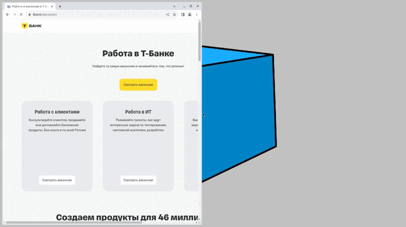

# Покрытие сайта tbank.ru тестами предоставляет множество преимуществ для бизнеса и пользователей. Вот основные из них:

Сайт — важный инструмент для представления продукции и взаимодействия с клиентами. Для обеспечения его надежности и качества необходимо внедрение тестирования.
Вот несколько причин, почему покрытие тестами критически важно:

1. **Обеспечение стабильности и надежности**: Тесты помогают выявить баги на ранних стадиях разработки или обновления сайта, предотвращая их попадание в продакшн.

2. **Улучшение пользовательского опыта (UX)**: Автоматизированное тестирование производительности помогает выявить узкие места и оптимизировать сайт.

3. **Соответствие законодательным и отраслевым требованиям**: Тесты проверяют корректную работу на разных устройствах, браузерах и операционных системах.

4. **Экономия времени и ресурсов**: Чем раньше найдена ошибка, тем дешевле и быстрее её исправить.

Покрытие сайта тестами — это инвестиция в качество продукта, безопасность пользователей и репутацию банка.

:

- [x] Проверка перехода на страницу для поиска вакансий
- [x] Проверка работы фильтров для выбранного направления
- [x] Проверка выбора чекбокса 'Тестирование' и проверка наличия вакансии 'Инженер по автоматизации тестирования (Java/Kotlin)
- [x] Проверка информации на странице для вакансии 'Инженер по автоматизации тестирования (Java/Kotlin)
- [x] Отклик на вакансию

Отчетность о прогоне тестов в Telegram позволит оперативно отслеживать потенциальные и уже существующие проблемы на сайте

Пример отчета:

Видео прогона одного из автотестов

)

